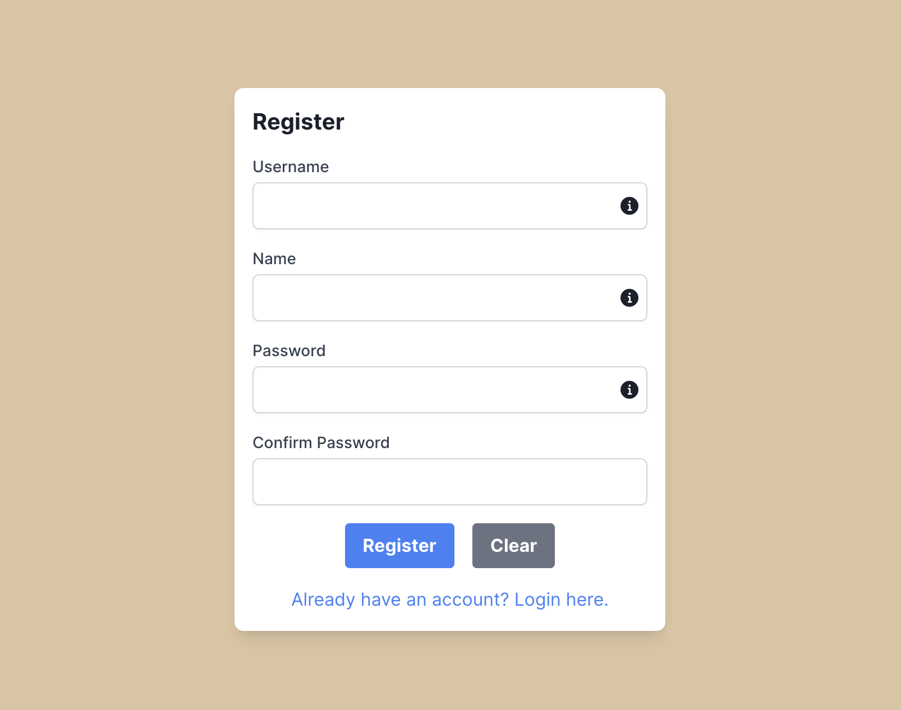

# DEMO

## Description
This project is a full-stack CRUD application demo using the Next.js framework for the frontend, NestJS framework for the backend, and MySQL as the database. The entire application is containerized with Docker and utilizes Nginx as a reverse proxy server. This project primarily demonstrates basic functionalities such as user registration, login, and product management.

<div>




</div>


### Tech-Stack
- Frontend: Next.js 14.2.2
- Backend: NestJS 10.0.0
- Database: MySQL 8
- Containerization: Docker
- Reverse Proxy: Nginx
- Authentication: JWT

### Main Features
- **User Registration**: Users can create new accounts via a registration API by providing a username and password. Passwords are hashed before storage to ensure security.
- **User Login and Authentication**: Upon login, users receive a JWT valid for 10 minutes. For testing purposes, the header's auto-expiry is set to 11 minutes to observe what happens when a token expires.
- **Product Management Interface**: Implements basic CRUD functionality for products. Only authenticated users can manage product information (add, delete, modify).

### Getting Started
- Environment Setup: Ensure Docker and Docker Compose are installed on your machine.
- Launching the Service:

```bash
git clone https://github.com/aa8100225/demo.git

cd demo

docker-compose up -d
```
### Accessing the Application:
- **HTTP Access**: Ensure the Nginx configuration file listens on port 80. http://localhost/login
- **HTTPS Access**: 
   - To enable HTTPS, generate certificate.pem and private.key and place them in the Nginx directory
   -  Modify the Nginx port settings in docker-compose.yml to "443:443", enable HTTPS-related configurations in the nginx DockerFile, and comment out HTTP-related configurations. 
   - Also, comment out HTTP-related and uncomment HTTPS-related in the root .env file.